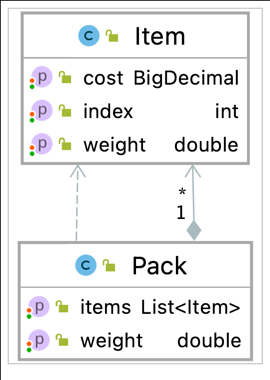

# Build
The project is using Java 11 and Maven to build. To build the project, run below command:

```shell
mvn clean install
```

The project also uses the Jacoco plugin to generate the coverage report. To generate the test coverage report, follow these steps:

Generate the report
```shell
mvn jacoco:report
```

Open the report on browser at this location `{project-folder}/target/site/jacoco/index.html`


# Layers

The codebase is grouped in 3 layers.This structure can help to separate the concerns of an application into three parts. And one change in this layer will not impact the others.


## Controller
This layer is the class `Packer`. 

This will load the data into the application from the file system. 

Then it will call the next layer, `Service` layer, to process and return the result. 

The outcome will then be returned in String type.

We can enhance this layer to work with multiple resources such as Database, FTP or email attachments.

## Persistance

This layer concentrates on the structure definition of these models and how to store/retrieve them.

There are two main models the application will work with: `Package` and `Item`.

Currently the application is storing data in memory, we can enhance this layer to persist data in a RDBMS or NoSQL data later.



## Service

This layer includes the main processing of application. It will:
- Use the raw data from the `Controller` layer and parse into models defined in `Persistance` layer
- Process to find the best packing result.

### Processing sequence
Below sequence diagram will depict the workflow of this layer.


### Processing algorithm

The processing algorithm will do below steps:
- Sort the list of items by Cost then Weight => The time complexity is θ(n^2).
- Iterate through the list of sorted items, select the subsequent items where the `total item weight` <= `package weight`. One set of selected items will be recorded in temporal processing list => The time complexity is θ(n^2).
- Return the set in the above list that has the largest Cost and least weight.